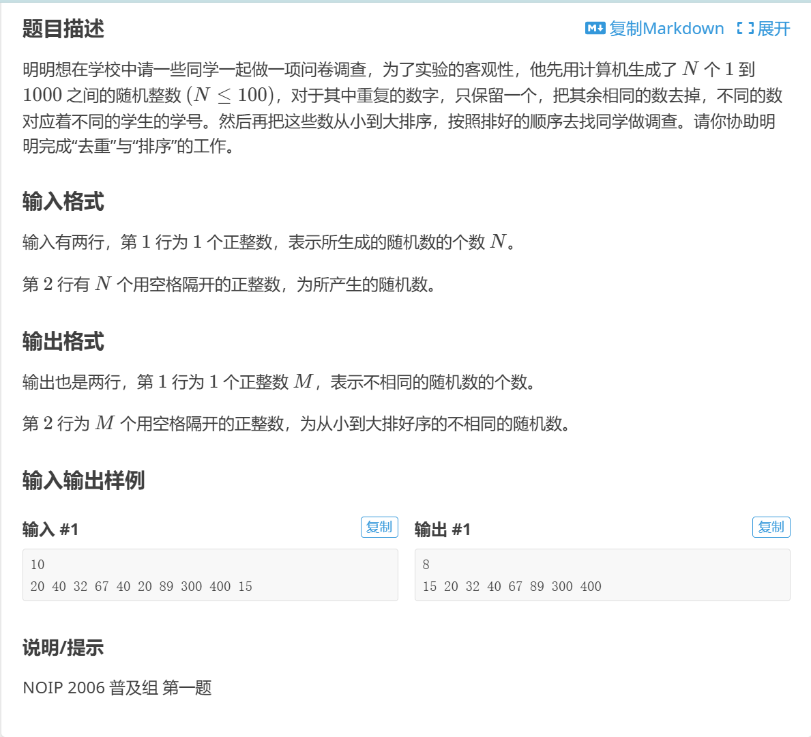

[返回目录](../readme.md)

# [NOIP2006 普及组] 明明的随机数!

[题目传送门](https://www.luogu.com.cn/problem/P1059)




# 思路
1. 首先将数据存入 set 容器，利用 set 容器的特性，自动去重
2. 然后将 set 容器中的数据存入 vector 容器，再对 vector 容器中的数据进行排序
3. 最后输出 vector 容器中的数据

# 代码
[参考代码](./P1059.cpp)

```cpp
#include <bits/stdc++.h>  
using namespace std;
int main()
{
    int n;
    cin >> n;
    set<int> st;  
    for (int i = 0; i < n; i++)
    {
        int t;
        cin >> t;
        st.insert(t);
    }
    vector<int> v(st.begin(), st.end());  
    sort(v.begin(), v.end());  
    cout << v.size() << "\n";
    for (int i = 0; i < v.size(); i++)
    {
        cout << v[i] << " \n"[i == v.size() - 1];  
    }
    return 0;
}
```