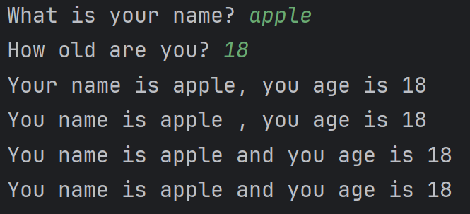

## Python3 基础语法

## 1. 注释
- 单行注释：以 `#` 开头
- 多行注释：以 `'''` 或 `"""` 开头和结尾

```python
# 我是单行注释

'''
我是
多行
注释
'''

"""
我也是
多行
注释
"""
```

## 2. 关键字
Python 的标准库提供了一个 `keyword` 模块，可以输出当前版本的所有关键字

```python
>>> import keyword
>>> keyword.kwlist
['False', 'None', 'True', 'and', 'as', 'assert', 'async', 'await', 'break', 'class', 'continue', 'def', 'del', 'elif', 'else', 'except', 'finally', 'for', 'from', 'global', 'if', 'import', 'in', 'is', 'lambda', 'nonlocal', 'not', 'or', 'pass', 'raise', 'return', 'try', 'while', 'with', 'yield']
```

## 3. 标识符
- 第一个字符必须是字母表中字母或下划线 `_` 
- 标识符的其他的部分由字母、数字和下划线组成
- 标识符对大小写敏感

当然也可以用中文

## 4. 数字类型
Python 支持 4 种整数类型：
- `int` 整数
- `bool` 布尔类型
- `float` 浮点数
- `complex` 复数

Python 并不像 C/C++ 语言一样，有最大值或最小值的限制，所以不需要考虑类型溢出问题

## 5. 输入与输出

### 5.1 输入

Python 的 `input()` 函数用于从键盘读取数据

```python
>>> num = input("Input a number:")
Input a number:5
```
`input()` 函数默认返回一个字符串，所以需要使用 `int()` 或 `float()` 转换为整数或浮点数

### 5.2 输出

Python 的 `print()` 函数用于输出数据

```python
>>> print("Hello, World!")
Hello, World!
>>> print(5)
5
```
`print()` 函数默认输出一个换行符，如果需要输出不换行，可以使用 `end` 参数
```python
>>> print("Hello, World!", end="")
Hello, World!
```
格式化输出
```python
>>> name = "John"
>>> age = 18
>>> print("My name is %s, I am %d years old." % (name, age))
My name is John, I am 18 years old.
>>> print("My name is {}, I am {} years old.".format(name, age))
My name is John, I am 18 years old.
>>> print(f"My name is {name}, I am {age} years old.")
My name is John, I am 18 years old.
```

## 6.应用

1. 个人信息

```python
name = input("What is your name? ")
age = int(input("How old are you? "))

print("Your name is " + name + ", you age is " + str(age))
print("You name is %s , you age is %d"%(name,age))
print(f"You name is {name} and you age is {age}")
print("You name is {name} and you age is {age}".format(name=name,age=age))
```

运行结果：
